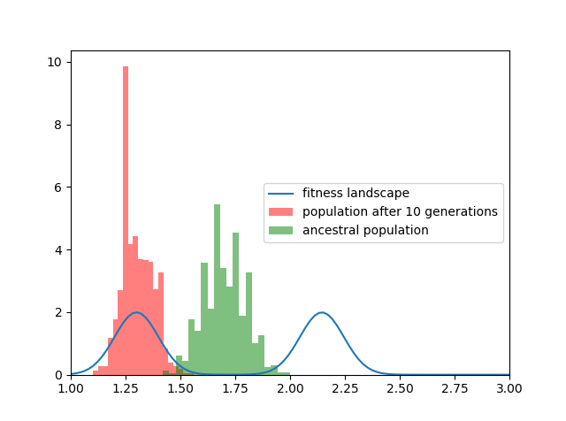

# ECO
Ecological and evolutionary simulations

## Disclaimer
The project is still in development, use code at your own risk!

## History
In order to simulate disruptive selection, a multi-peaked environmental fitness landscape function was designed. Individuals have hermaphroditic sexual reproduction and chromosomes subject to crossover. A minimal mutation rate is also present. The chances of reproduction are determined by their individual relative fitness, given by the fitness landscape on the phenotypic value of the individuals.

We note that disruptive selection cannot occur by the action of a multi-peaked environmental fitness landscape alone in a panmictic population. More acting forces are needed.
One of them is on sexual preference, which in this case should make similar phenotypes mutually attractive. 

The other one is the resource extinction, which should depend in some way on the phenotype density. E.g. fish size determines its prey, so if there are too many of similar sizes, they will have to strive harder to survive.

